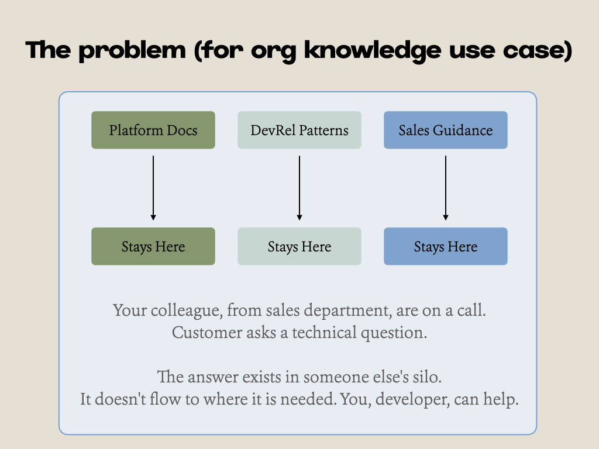
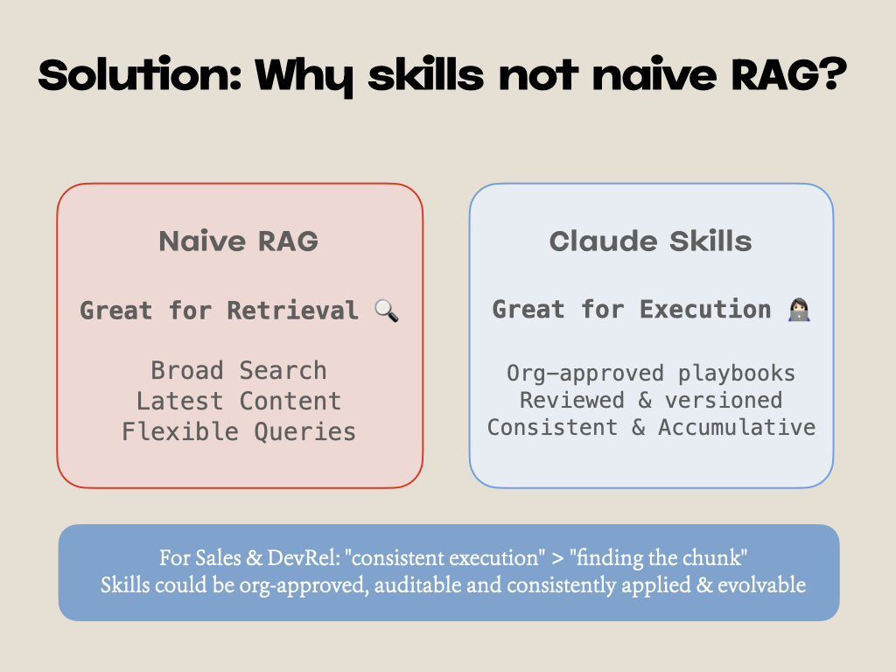
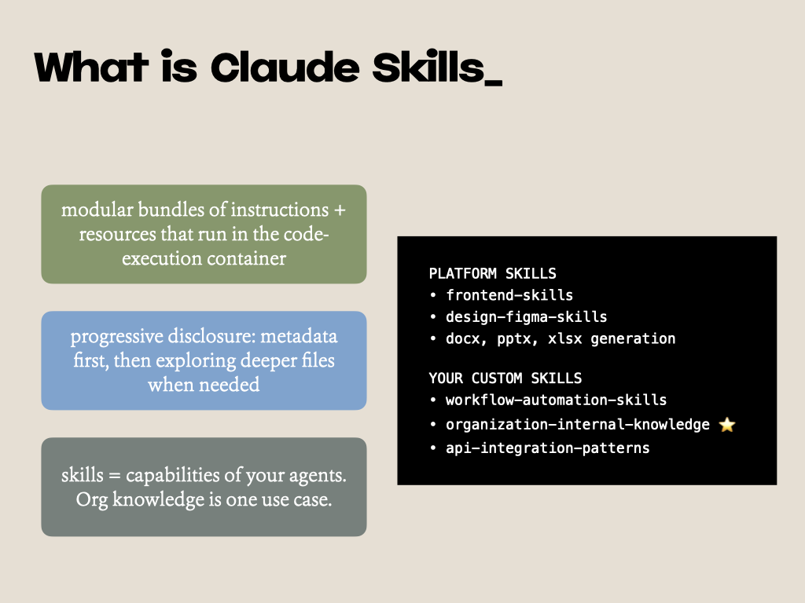
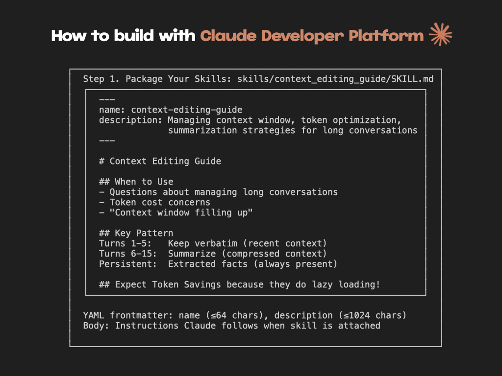
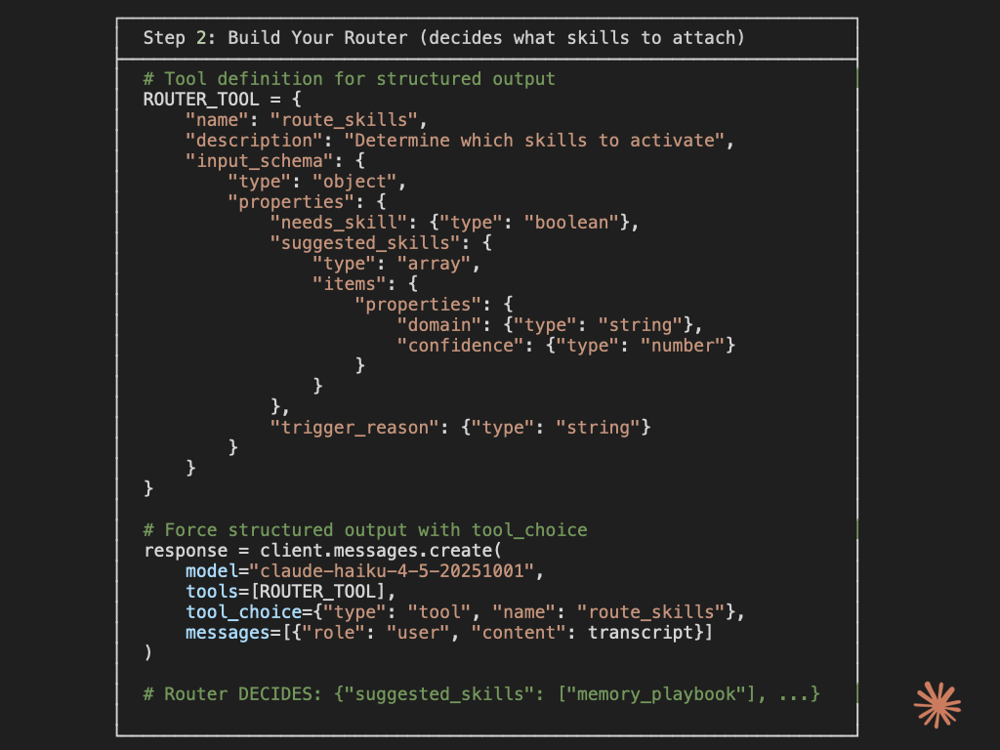
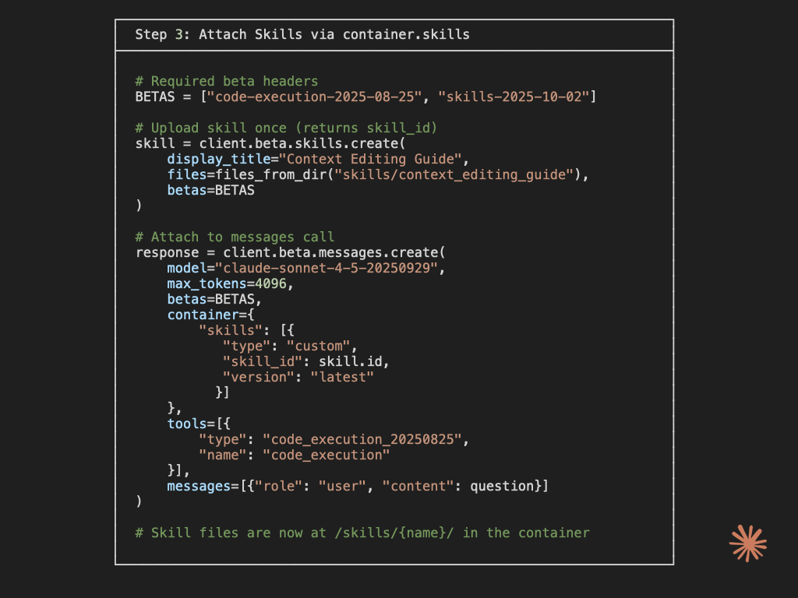
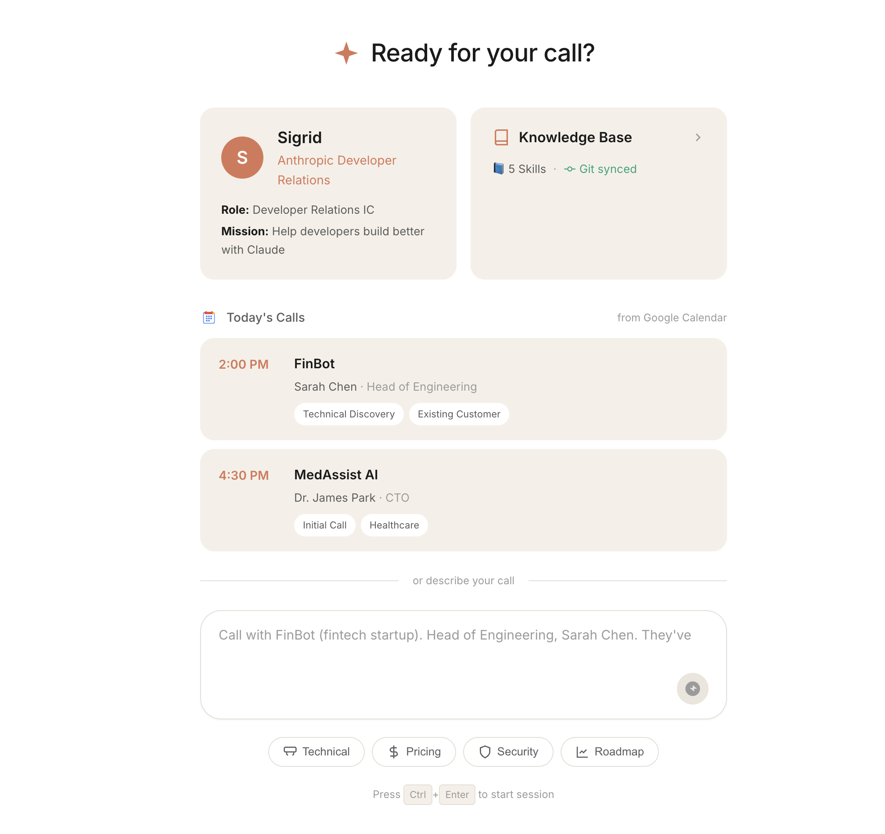
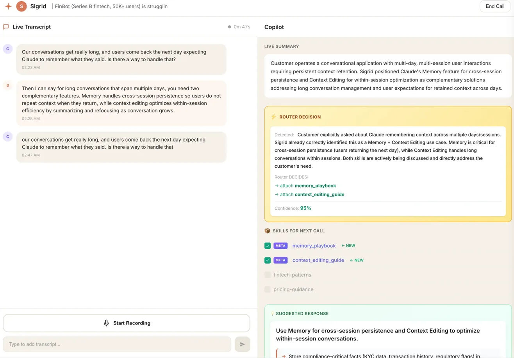
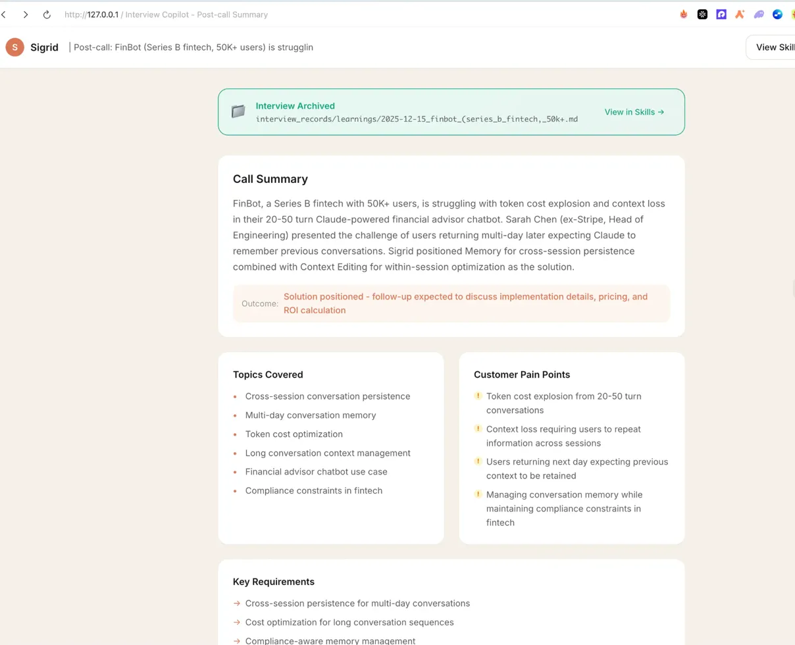
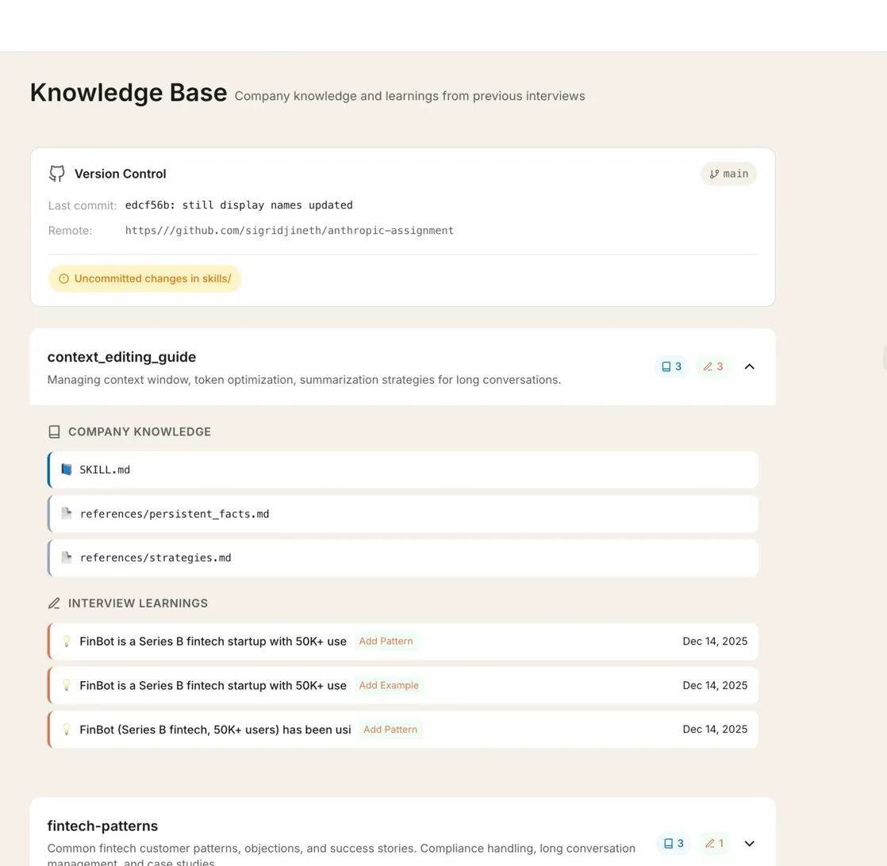

# Interview Copilot Demo for Claude Skills

* Vercel Demo: [Link](https://interview-copilot-with-skills.vercel.app/)
* Slides: [Link](https://drive.google.com/file/d/1v_ab8uoFnjoEL2LnMrHcmPybgdfiFYGr/view?usp=sharing)
* YouTube: [Link](https://youtu.be/GgGElsXZy2o)

A working demo that shows how to build multi-agent systems with Claude Skills.

Your sales colleague is on a call. Customer asks a technical question. The answer exists somewhere in your org's docs, but it's stuck in someone else's silo. Sound familiar?

This project fixes that. It's a real-time copilot that pulls the right knowledge at the right moment during customer calls.



## Why Skills, Not RAG?

I tried RAG first. It's great for search, but terrible for consistent execution.

When your DevRel team needs to answer "How does Context Editing work?" the same way every time, you don't want a system that retrieves different chunks depending on the query. You want a playbook. Something reviewed, versioned, and approved by your team.



That's what Claude Skills are: modular bundles of instructions that run in Claude's code execution container. Think of them as capabilities you give your agents. Org knowledge is just one use case.



## Building with Claude Skills (3 Steps)

### Step 1. Package Your Skills

Create a folder with a `SKILL.md` file. The frontmatter has name and description. The body contains instructions Claude follows when the skill is attached.

```
skills/
├─ context_editing_guide/
│  ├─ SKILL.md          ← Entry point (metadata + instructions)
│  └─ strategies.md     ← Pulled in on demand
├─ memory_playbook/
│  └─ SKILL.md
└─ fintech_patterns/    ← Team learnings from past calls
```

Your `SKILL.md` looks like this:

```yaml
---
name: context-editing-guide
description: Managing context window, token optimization, summarization strategies
---

# Context Editing Guide

## When to Use
- Questions about managing long conversations
- Token cost concerns
- "Context window filling up"

## Key Pattern
Turns 1-5:   Keep verbatim (recent context)
Turns 6-15:  Summarize (compressed context)
Persistent:  Extracted facts (always present)
```



### Step 2. Build a Router

The router decides which skills to attach based on the conversation. Use structured output with `tool_choice` to force a clean decision:

```python
ROUTER_TOOL = {
    "name": "route_skills",
    "description": "Determine which skills to activate",
    "input_schema": {
        "type": "object",
        "properties": {
            "needs_skill": {"type": "boolean"},
            "suggested_skills": {
                "type": "array",
                "items": {
                    "properties": {
                        "domain": {"type": "string"},
                        "confidence": {"type": "number"}
                    }
                }
            },
            "trigger_reason": {"type": "string"}
        }
    }
}

response = client.messages.create(
    model="claude-haiku-4-5-20251001",
    tools=[ROUTER_TOOL],
    tool_choice={"type": "tool", "name": "route_skills"},
    messages=[{"role": "user", "content": transcript}]
)
```



### Step 3. Attach Skills via container.skills

Upload your skill once, then attach it to any message call:

```python
BETAS = ["code-execution-2025-08-25", "skills-2025-10-02"]

# Upload skill (do this once)
skill = client.beta.skills.create(
    display_title="Context Editing Guide",
    files=files_from_dir("skills/context_editing_guide"),
    betas=BETAS
)

# Attach to messages
response = client.beta.messages.create(
    model="claude-sonnet-4-5-20250929",
    max_tokens=4096,
    betas=BETAS,
    container={
        "skills": [{
            "type": "custom",
            "skill_id": skill.id,
            "version": "latest"
        }]
    },
    messages=[{"role": "user", "content": question}]
)
```



## Architecture

Four agents work together. Haiku handles the fast routing decisions, Sonnet handles the actual answers where quality matters.


| Agent | Model | Job |
|-------|-------|-----|
| Prep Agent | Haiku 4.5 | Takes customer info, creates session with relevant skills enabled |
| Router Agent | Haiku 4.5 | Watches transcript, decides which skills to activate |
| Answer Agent | Sonnet 4.5 | Generates responses using the attached skills |
| Postmortem Agent | Haiku 4.5 | After the call, proposes skill updates based on what was learned |

The postmortem loop is where it gets interesting. Every call teaches the system something. New objection patterns, pricing questions, technical edge cases. The agent proposes updates to your skills, you review them via PR, and the next call benefits.

## Quick Start

### 1. Install dependencies

```bash
uv sync
```

### 2. Set up your API key

```bash
cp .env.example .env
# Add your ANTHROPIC_API_KEY
```

### 3. Run

```bash
uv run uvicorn src.main:app --reload
```

Open http://localhost:8000

## What It Looks Like

The landing page shows your upcoming calls and lets you describe the customer:



During the call, you get a split view. Transcript on the left, copilot suggestions on the right:



After the call, you get a summary with pain points, topics covered, and recommended follow-ups:



Your skills live in a knowledge base that's version-controlled and synced with git:



## API Endpoints

| Endpoint | Method | What it does |
|----------|--------|--------------|
| `/` | GET | Landing page |
| `/api/prep` | POST | Generate session brief |
| `/api/session` | POST | Create new session |
| `/session/{id}` | GET | Session page |
| `/api/session/{id}/transcript` | POST | Add transcript entry |
| `/api/session/{id}/ask` | POST | Ask copilot directly |
| `/api/session/{id}/state` | GET | Get current session state |
| `/api/session/{id}/end` | POST | End session, trigger postmortem |

## Development

```bash
make dev      # Run with auto-reload
make test     # Run tests
make lint     # Check code
make format   # Format code
```

## Skills in This Demo

| Skill | What it covers |
|-------|----------------|
| `context_editing_guide` | Token optimization, summarization strategies |
| `memory_playbook` | Cross-session persistence, multi-day conversations |
| `pricing_guidance` | Claude API pricing, tier recommendations |
| `fintech_patterns` | Industry-specific objections and patterns |

## Learn by Running

If you want to understand Skills without digging through the full app, there's a standalone script that walks through the entire flow.

```bash
uv run python scripts/demo_skills_api.py
```

It runs real API calls and prints exactly what's happening at each step: SKILL.md structure, Router decisions, container.skills attachment, and the postmortem flywheel. Takes about 30 seconds to run. No setup beyond your API key.

For a more detailed breakdown, see **[docs/LEARNING_MATERIALS.md](docs/LEARNING_MATERIALS.md)**.

## Deep Dive: Building with Skills

Want to understand how this project works under the hood? Check out the detailed guide:

**[SKILLS GUIDE](./docs/SKILLS_GUIDE.md)** covers:
- SKILL.md format and structure
- Uploading skills via the API
- Building a router with structured output
- Fallback patterns when the API isn't available
- Post-call learning loop
- Real code examples from this project

## Links

- [Official Skills Guide](https://platform.claude.com/docs/en/build-with-claude/skills-guide)
- [Skills API Reference](https://platform.claude.com/docs/en/api/skills/create-skill)
- [Tool Use (Structured Output)](https://docs.anthropic.com/en/docs/build-with-claude/tool-use)
- [Code Execution](https://docs.anthropic.com/en/docs/build-with-claude/code-execution)

## Questions?

sigrid.jinhyung@gmail.com
